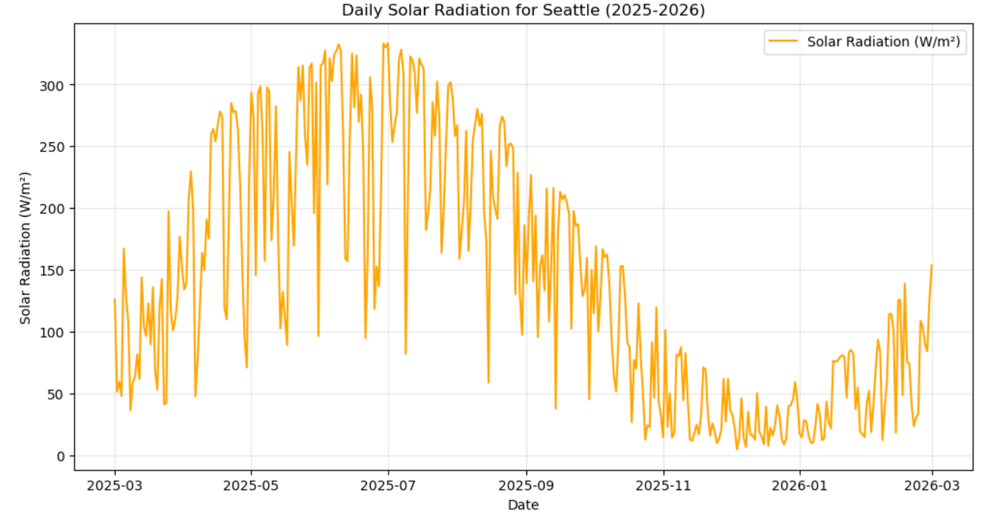

---

# SolarAnywhere: Renewable Energy Data Pipeline

This system transforms geographic data into a precise engineering tool for solar planning. By bridging the gap between raw data and real-world utility, it provides high-fidelity energy estimations for informed environmental decision-making.

## Project Overview
This project analyzes how solar panel energy output varies by location and mobile device battery capacity using real-world meteorological data. It translates complex solar radiation metrics into practical, consumer-facing insights by modeling performance across polar-opposite climate profiles.

## Comparative Analysis: Seattle vs. Eritrea
To validate the algorithm’s reliability, this study compares two regions with drastically different solar irradiance patterns:
* **Seattle, WA (47.6° N):** Characterized by high seasonal variance. The analysis explores "Energy Poverty" during Pacific Northwest winters, where low-irradiance days require a 3-4x larger solar footprint to maintain daily device charging.
* **Asmara, Eritrea (15.3° N):** Serves as the equatorial control group. With consistent year-round solar flux, this region proves that a minimal 20W setup can achieve nearly 100% reliability, highlighting the impact of latitude on hardware requirements.
## Project Assets
* **Technical Presentation:** [View the SolarAnywhere Analysis PDF](./SolarAnywhere_Presentation.pdf) — A deep dive into the engineering logic and data visualizations used in this project.
### Hardware Specifications

* **Weather & Solar Data:** [Visual Crossing Weather API](https://www.visualcrossing.com/) (Historical Solar Radiation Flux).
* **Battery Profiles:** Technical data for modern mobile devices measured in Watt-hours (Wh).

---

### 📱 Device Capacity Reference Guide
The following Python dictionary can be used to programmatically map device models to their battery specifications within the `SolarAnywhere` environment.

```
# Hardware Specification Mapping
# Energy (Wh) calculated at 3.85V nominal voltage
device_hardware_profiles = {
    "OnePlus 13": {
        "capacity_mah": 6000,
        "energy_wh": 23.10,
        "profile": "High-Density"
    },
    "Google Pixel 10 Pro XL": {
        "capacity_mah": 5200,
        "energy_wh": 20.02,
        "profile": "Large Flagship"
    },
    "Samsung Galaxy S25 Ultra": {
        "capacity_mah": 5000,
        "energy_wh": 19.25,
        "profile": "Ultra-Premium"
    },
    "iPhone 16 Pro Max": {
        "capacity_mah": 4685,
        "energy_wh": 18.04,
        "profile": "Baseline"
    },
    "iPhone 16 Pro": {
        "capacity_mah": 3582,
        "energy_wh": 13.79,
        "profile": "Standard Pro"
    },
    "iPhone 16": {
        "capacity_mah": 3561,
        "energy_wh": 13.71,
        "profile": "Standard"
    }
}

def calculate_charge_time(device_name, solar_output_watts):
    """
    Calculates estimated hours to charge based on solar flux.
    """
    device = device_hardware_profiles.get(device_name)
    if device:
        return device["energy_wh"] / solar_output_watts
    return None
## Project Visualizations

### 365-Day Solar Radiation Trend (Seattle 2025-2026)


### Reliability Analysis: ICDF Curve


### Distribution of Solar Panels Needed (With Outliers)


### Hardware Requirements by Phone Model


## Key Technical Features
* **Live API Integration:** Fetches the latest 365 days of solar radiation data (**2025–2026**) for real-time accuracy.
* **Secure Authentication:** Implemented a "Fallback Logic" system that allows for seamless user demos while protecting private API credentials.
* **Applied Engineering:** Translates raw $W/m^2$ into specific hardware requirements, such as the exact number of panels needed to charge specific devices.

## Summary of Findings
* **Battery Impact:** Device capacity is the primary driver of hardware requirements; larger batteries require significantly higher panel counts to maintain daily charge cycles.
* **Geographic Variation:** While Eritrea offers consistent output, Seattle’s seasonal fluctuations necessitate larger solar arrays to prevent energy deficits during low-light months.
* **Data Fidelity:** Utilizes live 2026 data to ensure the analysis reflects current weather patterns and climate trends.

## Skills Demonstrated
* **Python:** Pandas (Data Manipulation), NumPy (Numerical Analysis), Matplotlib (Visualization), Geopy (Geospatial Mapping).
* **Data Visualization:**
    * **Box-and-Whisker Plots:** Utilized to visualize solar irradiance distribution and identify seasonal outliers beyond simple medians.
    * **ICDF (Inverse Cumulative Distribution Function) Curves:** Applied to calculate the probability of energy sufficiency on low-light days.
* **Project Management:** Git/GitHub version control and Agile/Kanban lifecycle management.

## How to Run
1. **Clone the repository:**
   ```bash
   git clone [https://github.com/pityasteaghes04/SolarAnywhere.git](https://github.com/pityasteaghes04/SolarAnywhere.git)
   ```
2. **Install dependencies:**
   ```bash
   pip install -r requirements.txt
   ```
3. **Execution:**
   Open `SolarAnywhere_PityasT.ipynb` file in your preferred notebook environment.
4. **API Access:**
   When prompted for an API key, press **Enter** to use the built-in demo fallback key.
```
